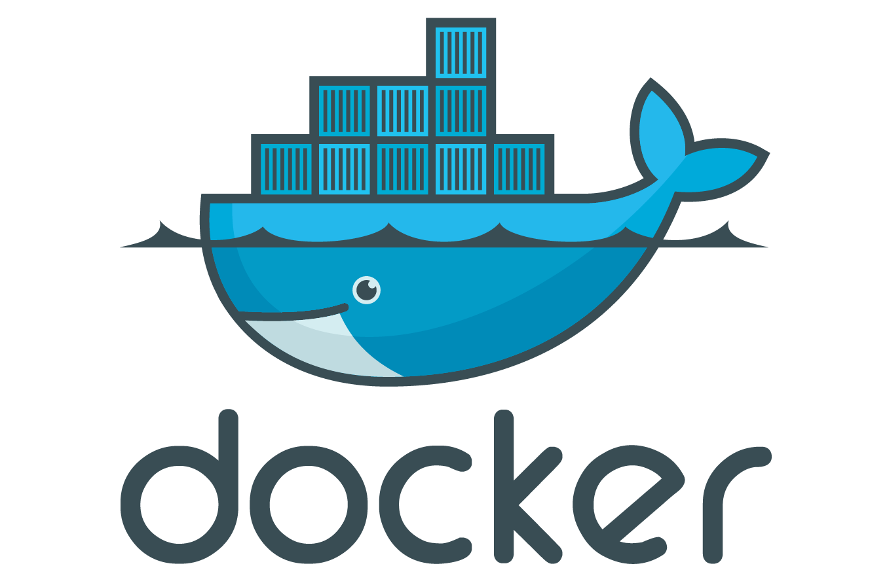

# Docker使用说明



<!-- TOC -->

- [Docker使用说明](#docker使用说明)
    - [在Ubuntu主机安装Docker](#在ubuntu主机安装docker)
    - [docker-compose安装](#docker-compose安装)
    - [docker 查看镜像](#docker-查看镜像)
    - [docker查看运行中或停止的容器](#docker查看运行中或停止的容器)
    - [docker镜像拉取](#docker镜像拉取)
    - [docker启动容器](#docker启动容器)
    - [docker进入容器](#docker进入容器)
    - [docker删除镜像](#docker删除镜像)
    - [docker删除容器](#docker删除容器)

<!-- /TOC -->

## 在Ubuntu主机安装Docker

    ```
    curl -fsSL https://get.docker.com | bash -s docker --mirror Aliyun
    ```

## docker-compose安装

    ```
    # 将docker-compose下载到``
    sudo curl -L "https://github.com/docker/compose/releases/download/1.24.1/docker-compose-$(uname -s)-$(uname -m)" -o /usr/local/bin/docker-compose
    # 赋予docker-compose执行权限
    sudo chmod +x /usr/local/bin/docker-compose
    ```

## docker 查看镜像

    ```
    docker images
    ```

## docker查看运行中或停止的容器

    ```
    docker ps -a
    ```

- -a参数代表查看所有容器


## docker镜像拉取

    ```
    docker pull ubuntu:16.04
    ```

## docker启动容器

    ```
    docker run --name sitonholy  -v /root:/root -p 80:80 -itd ubuntu bash
    ```
    
- -it 是用于启动容器命令，这里启动了bash命令
- -d 选项是挂载到后台，容器退出后仍然运行
- -v 参数是挂载目录 对应关系为 {主机}：{容器}
- -p 参数是映射端口 对应关系为 {主机}：{容器}

## docker进入容器

    ```
    docker exec -it sitonholy bash
    ```
- sitonholy 代表container的ID码或名称

## docker删除镜像

    ```
    docker rmi -f ubuntu:16.04
    ```
- -f参数十分危险，意味着如果有运行的容器则也会删除这个镜像

## docker删除容器

    ```
    docker rm -f sitonholy
    ```
- -f参数危险，会强制删除启动中的容器