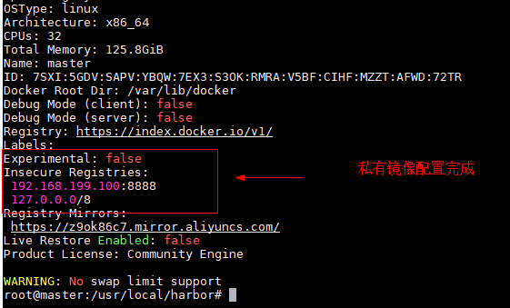
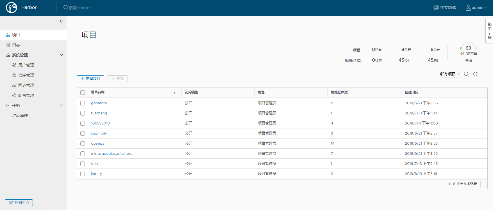
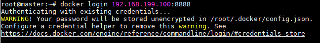
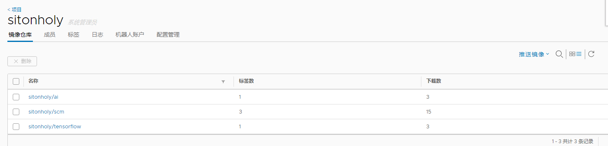

# Harbor 使用手册

本教程对SCM Harbor离线教程\


## 安装本地Docker镜像仓库Harbor

Harbor官方地址：[Harbor](https://github.com/goharbor/harbor)\
请下载目前最新的release版本：[harbor-offline-installer-v1.8.1.tgz](https://storage.googleapis.com/harbor-releases/release-1.8.0/harbor-offline-installer-v1.8.1.tgz)

1. 安装[Docker](./Docker.md)

2. 安装[docker-compose](./Docker.md)

3. 解压打开`harbor`目录

4. 编辑文件[harbor.yml](./yml/harbor.yml)修改选项\
    - hostname
    - port
    - harbor_admin_password
    - data_volume

5. 修改完成后执行目录中`./install.sh`完成安装

## 修改客户机docker支持私有镜像

1. 编辑客户机`/etc/docker/daemon.json`文件
    ```
    {
        "insecure-registries": ["192.168.1.10:8888"],
        "registry-mirrors": ["https://z9ok86c7.mirror.aliyuncs.com"]
    }
    ```

2. 重启客户机docker服务
    ```
    service docker restart
    ```

3. 查看客户机docker是否配置了私有镜像
    
    

## 使用Harbor

1. 在chrome中查看Harbor\
   
   user|password
   ---:|:---
   admin|Harbor12345

   

2. 创建一个新的项目空间

a. 点击新建项目，命名为sitonholy,设置为公开

b. 在主机上登录到私有仓库



3. 下载ubuntu镜像`docker pull ubuntu:16.04`

4. 修改tag

    ```
    docker tag ubuntu:16.04 192.168.1.10:80/sitonholy/ubuntu:16.04
    ```

5. 上传到私有镜像仓库中
    ```
    docker push 192.168.1.10:80/sitonholy/ubuntu:16.04
    ```

6. 查看上传的镜像
    

7. 下载私有仓库的镜像

    ```
    docker pull 192.168.1.10:80/sitonholy/ubuntu:16.04
    ```