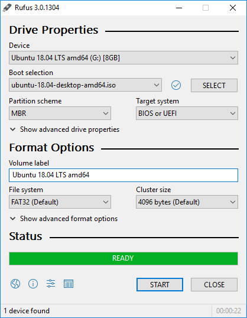
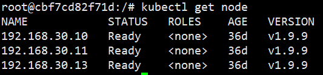
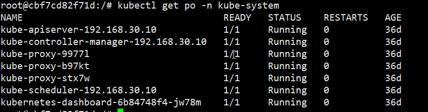
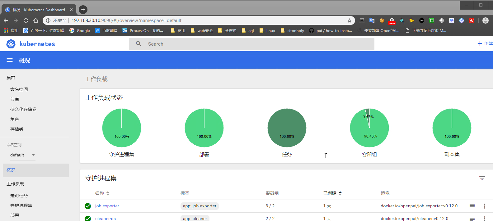
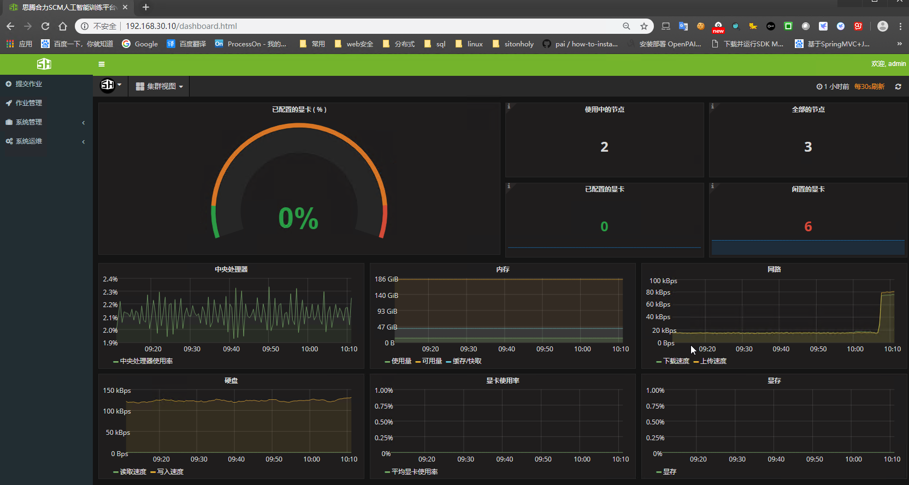

# Sitonholy Cluster Manager
本教程用于安装思腾合力SCM集群软件


## 安装集群软件到您的机器上

<!-- TOC -->

- [Sitonholy Cluster Manager](#sitonholy-cluster-manager)
    - [安装集群软件到您的机器上](#安装集群软件到您的机器上)
    - [硬件选用](#硬件选用)
    - [系统配置选项](#系统配置选项)
    - [系统安装](#系统安装)
    - [安装本地Docker镜像仓库Harbor](#安装本地docker镜像仓库harbor)
    - [集群软件安装](#集群软件安装)
        - [存储节点](#存储节点)
        - [计算节点](#计算节点)
        - [部署节点](#部署节点)
    - [测试使用](#测试使用)

<!-- /TOC -->

## 硬件选用
Sitonholy集群软件配置需要四部分：
- 储存节点
- 计算节点
- 管理节点
- 部署节点

各节点使用的硬件最小配置为:

Node|CPU|Mem|Disk
---|:---|:---|:---:
Master|16core|32G|500G
Compute|16core|16G|500G
Storage|4core|8G|100G
Deploy|4core|4G|100G


## 系统配置选项 
操作系统需要使用ubuntu16.04.6系统
- 系统下载链接：[ubuntu16.04.6](https://mirrors.aliyun.com/ubuntu-releases/16.04.6/ubuntu-16.04.6-server-amd64.iso)

做U盘镜像推荐使用工具rufus
- 下载地址：[rufus](https://github.com/pbatard/rufus/releases/download/v3.6/rufus-3.6.exe)



## 系统安装

1. 安装请使用**Legacy BIOS**模式来启动U盘安装，否则可能会出现boot分区无法打开引导选项

2. U盘启动后进入系统安装器：
  - a. 语言选择英文
  - b. 时区选择中国
  - c. 键盘选择美国
  - d. 不添加其他键盘
  - e. 键盘选择美国
  - f. 网络选择手动配置，**配置为固定IP**
  - g. 主机名可以按节点类型来命名
  - h. 设置管理员用户可以自行规定名称和密码
  - i. 不加密目录
  - j. 应用时区设置
  - k. 手动分区硬盘Manual
  - l. boot分区：分配1G空间给[**boot**](./images/boot.png)设置ext4格式并将Bootflags flag选项设置为on
  - m. 根分区：将其他空间分配给[**/**](./images/root.png)并设置为xfs格式
  - n. 在最后的软件安装中选上ssh连接工具完成安装

3. 开机后打开文件`/etc/dafault/grub`

将GRUB_CMDLINE_LINUX_DEFAULT插入如下信息
`GRUB_CMDLINE_LINUX_DEFAULT="rootflags=uquota,pquota"`

修改后保存退出，更新ubuntu内核版本
- `update-grub`
- `reboot`

4.  如果有挂载其他硬盘的话，挂载位置是用于docker的镜像路径的话，则需要挂载选项为

`UUID=46fd90a5-402d-4c43-b47b-681979ef00d1 /var/lib/docker xfs defaults,pquota 0 0`
    
挂载完成后，`mount -a`生效

5. 查看目前使用内核（确认为4.4.0-142版本）

```

uname -a

```

6. 查看apt-mark支持保持不升级的内核包

```

user@ubuntu:~$ sudo apt-mark showmanual|grep linux
console-setup-linux
libselinux1
linux-base
linux-generic
linux-headers-generic
util-linux

```

7. 保持内核不更新

```

sudo apt-mark hold linux-generic linux-headers-generic

```


此时系统安装完成

## 安装本地Docker镜像仓库Harbor

- 安装[Harbor](./Harbor.md)


## 集群软件安装

### 存储节点

1. 安装nfs服务器软件

    ```
    sudo apt install nfs-kernel-server
    ```

2. 创建共享目录

    ```
    sudo mkdir -p /nfs/
    sudo chmod 777 /nfs/
    ```

3. 编辑文件`/etc/export`,添加内容

    ```
    /nfs/ 192.168.1.0/24(rw,sync,no_root_squash,no_subtree_check)
    ```

    添加后使用命令`exportfs -a`生效配置

    查看挂载 `showmount -e 192.168.1.100`

### 计算节点

1. 安装nfs客户端软件

    ```
    sudo apt install nfs-kernel-server
    ```

2. 创建挂载目录

    ```
    mkdir /nfs
    mkdir /nfs/{users,user_dir_file}
    ```

3. 在`/etc/fstab`中挂载目录

    ```
    192.168.1.11:/nfs /nfs nfs defaults 0 0
    ```
    
4. 挂载nfs

    ```
    mount -a    #挂载
    df -h       #查看
    ```

5. 查询显卡类型

   ```
    sudo update-pciids
    lspci -nn | grep '\[03'
   ```

6. 安裝java 8 

```

sudo apt install openjdk-8-jdk-headless

```

7. 解压缩check-license.tar.bz2 

```

tar jxvf check-license.tar.bz2

```

8. 移动压缩目录sentinel-license-check⾄/opt 

```

sudo mv sentinel-license-check /opt

```

9. 执⾏/opt/sentinel-license-check/install-service.sh 

```

sudo bash /opt/sentinel-license-check/install-service.sh

```

### 部署节点

1. 在部署节点中安装[Docker](./Docker.md)

2. Docker安装完成后下载部署镜像

   ```

   docker pull 105552010/openpai-devbox:v0.12.13

   ```

3. 镜像下载完成后打开镜像

   ```

   docker run --name dev-box -itd 105552010/openpai-devbox:v0.12.13 bash

   ```

4. 打开镜像

    ```

    docker exec -it deploy bash
    
    ```

5. 切换到目录`~/pai-config`

6. 编辑文件
    - [layout.yaml](./yml/layout.yaml)
    - [kubernetes-configuration.yaml](./yml/kubernetes-configuration.yaml)
    - [services-configuration.yaml](./yml/services-configuration.yaml) 
    - [/pai/src/webportal/deploy/webportal.yaml.template](./yml/webportal.yaml.template)
  

    以下文件需要直接替换

    - [/pai/src/rest-server/deploy/rest-server.yaml.template](./yml/rest-server.yaml.template)
    - [/pai/src/rest-server/config/rest_server.py](./yml/rest_server.py)


]
7. 进入目录`/pai`

8. 执行命令`./paictl.py cluster k8s-bootup -p ~/pai-config` 

   完成安装kubernetes

9. 查看k8s集群状态

    `kubectl get node`

    

    `kubectl get po -n kube-system`

    
    
    当所有容器启动成功后则可以进行下一步安装

10. 启动SCM服务

    ```
    cd /pai
    ./paictl config push -p ~/pai-config
    ./paictl service start
    ```

    等待集群安装成功，则可以使用

11. 添加集群显卡信息

    a. 使用如下命令找到gpu-configuration.json相应信息

    `kubectl edit cm gpu-configuration`

    b. 新建文件`gpu-configuration.json`

    创建如下内容,要对应a步骤的gpu-configuration

    ```
    { 
        "nodes" : { 
            "192.168.0.49" : { 
                "gpuType" : "P104", 
                "gpuCount" : 2 
                },
            "192.168.0.125" : { 
                    "gpuType" : "P106", 
                    "gpuCount" : 1 
                },
            "192.168.0.247" : { 
                "gpuType" : "none", 
                "gpuCount" : 0 
                } 
            }
    }
    ```

    c. 推送到kubernetes

    ```
    curl -X PUT -H "Content-Type: application/json" -H "UserName: root" -d @gpu-configuration.json "http://192.168.1.100:9086/v1/LauncherRequest/ClusterConfiguration"
    ```

12. 安裝sentinel run-time

    ```

    wget https://www.dropbox.com/s/p9cz4p4160xke5a/aksusbd_7.901_amd64.deb
    dpkg -i aksusbd_7.901_amd64.deb
    ```

13. 验证集群

    - chrome登录到主节点的9090端口,检查状态

    

    - 登录到主节点80端口，测试集群
    
    


14. 在主机上查看显卡使用率

    ```
    echo "alias nvidia-smi='/var/drivers/nvidia/current/bin/nvidia-smi'" >> ~/.bashrc
    source ~/.bashrc
    ```
        
## 测试使用


请参考测试文档：[SCM测试程序](https://github.com/sitonholy/scm#%E6%A0%87%E5%87%86%E6%B5%8B%E8%AF%95%E7%A8%8B%E5%BA%8F)
    