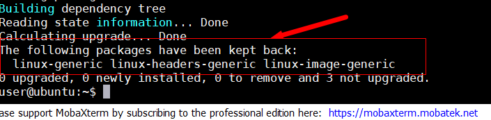

# TroubleShooting

编写此文档的意义在于排除搭建过程中遇到的各类问题
编写的内容不会很完善，有任何问题请联系Sitonholy

#### K8s无法启动

1. 请检查硬件配置是否符合标准[硬件选用](./README#硬件选用)

2. 如果部署成功过，因为配置原因无法重启K8s服务的话，则在dev-box尝试清除K8s集群环境

```
cd /pai
./paictl cluster k8s-clean -p ~/pai-config -f
```

#### 驱动容器无法启动

1. 在k8s-dashboard中查看显卡驱动报错原因

2. 尝试删除驱动重新部署

```
./paictl service delete -n drivers
```

#### 新建集群无法找到显卡

请参考[部署节点](./README.md#部署节点)

#### pylon报错

查询某一个节点的docker，看是否有某一个docker占用了Pylon所用的端口号

#### grafana抓不到数据

先看一下prometheus主机时间和客户机是否一致，不一致则调整时间为一致

#### 自建容器无法打开web ssh服务

在容器中安装openssh-server和curl服务，将容器生成新镜像
用新镜像重启启动任务即可打开

#### 我应当如何使用命令行连接到容器中

对于我们打包的镜像，您可以使用

`ssh -p {端口号} {容器所在节点IP}`

进行登录


如果您需要自己打包镜像

需要提前在容器中安装`openssh-server `

然后打开root登录权限，并设置root密码

打开ssh配置文件 `/etc/ssh/sshd_config`   

修改`PermitRootLogin yes`

然后重启ssh服务

`service ssh restart`

就可以连接了

#### 文件管理中的文件在容器的哪里？

在容器中，您需要切换到路径`/root/data`下进行工作

其他目录不会被映射到主机的NFS空间中


#### 我应当如何上传或下载私有镜像

当您在容器中做修改，您可以先登录到对应节点的主机上查找容器

`docker ps|grep {任务名称}`

找到容器后进入容器

`docker exec -it {任务对应容器id} bash`

安装ssh,curl服务

`apt install openssh-server curl -y`

设置root密码

`passwd root`

修改配置文件`/etc/ssh/sshd_config`

将此行修改为`PermitRootLogin yes`

重启ssh服务`service ssh restart`

#### Ubuntu16.04禁用内核更新

查看ubuntu目前使用的内核

```

uname -a
Linux ubuntu 4.4.0-131-generic #157-Ubuntu SMP Thu Jul 12 15:51:36 UTC 2018 x86_64 x86_64 x86_64 GNU/Linux
```


查看apt-mark支持保持不升级的内核包

```

user@ubuntu:~$ sudo apt-mark showmanual|grep linux
console-setup-linux
libselinux1
linux-base
linux-generic
linux-headers-generic
util-linux

```

保持内核包不更新

```

sudo apt-mark hold linux-generic linux-headers-generic
```

查看是否执行成功

```bash

user@ubuntu:~$ sudo apt-mark showhold
linux-generic
linux-headers-generic

```

关闭apt更新操作

将1改为0就好

```
sudo vi /etc/apt/apt.conf.d/10periodic'

		APT::Periodic::Update-Package-Lists "0";
		APT::Periodic::Download-Upgradeable-Packages "0";
		APT::Periodic::AutocleanInterval "0";

```

执行更新测试（注意，这步骤不用做，只是为了测试）

```
apt update
apt upgrade
```

可以发现图片内容，内核模块保持不更新

